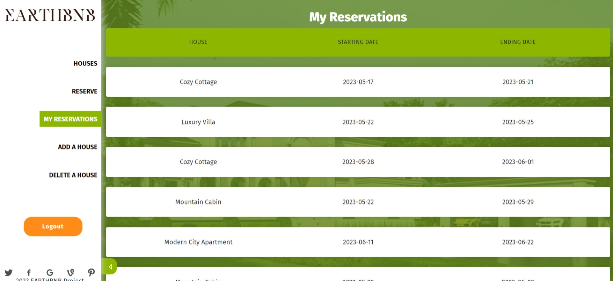

<a name="readme-top"></a>
 
 <div align="center">
 
   
 
 </div>
 
 
 <!-- TABLE OF CONTENTS -->
 
 # 📗 Table of Contents
 
 - [📖 About the Project](#about-project)
   - [🛠 Built With](#built-with)
     - [Key Features](#key-features)
     - [Live Demo](#live-demo)
     - [User Interface](#ui)
 - [💻 Getting Started](#getting-started)
   - [Setup](#setup)
   - [Prerequisites](#prerequisites)
   - [Install](#install)
   - [Usage](#usage)
 - [📃 Kanban Board](#kanban-board)
 - [👥 Authors](#authors)
 - [🔭 Future Features](#future-features)
 - [🤝 Contributing](#contributing)
 - [⭐️ Show your support](#support)
 - [🙏 Acknowledgements](#acknowledgements)
 - [📝 License](#license)
 
 <!-- PROJECT DESCRIPTION -->
 
 # 📖 Project Name
 
 ## EarthBnb Frontend User Interface
 
 ## About this project
 
 This web application is built to enable users browser through different houses which they can reserve on choice basis. The users can add their own houses to let other users reserve that for extra income. Users can register an account to use the website with full access with a unique username. The whole application is built in two major parts. The [Earthbnb_backend](https://github.com/PrangonGhose/Earthbnb-backend) holds code for the API backend that returns and handles the database on API request from the frontend of this website. The [Earthbnb_frontend](https://github.com/PrangonGhose/Earthbnb-frontend) contains the user interface of the website where the users can interact with the database. The backend of the website is created with `Ruby on Rails API` and the frontend is created with `ReactJS` and `Redux`.
 
 ## 🛠 Built With <a name="built-with"></a>
 
       
 
 <!-- Features -->
 
 ### Key Features <a name="key-features"></a>
 
 > Key features of the application.
 
 - A full stack webapp where users can register and sign in using a unique username. 
 - Users can add, delete and browse through the reigstered houses and reserve any house on choice.
 - API endpoints `/houses` and `/houses/:id` are available publicly whereas API endpoints `/reservations` and `/reservations/:username` is private only to registered and logged in users.
 - Users will be able to reserve a house in an available date. It is made sure by the developers that a user cannot reserve a house within a date range if any other user has already reserved it.
 - Users reservation data is private to every user and none can access each others data.
 - The API returns different type of organized errors for bad requests. 
 - The UI of the website is built following this [design guidelines](https://www.behance.net/gallery/26425031/Vespa-Responsive-Redesign).
 - The API is documented using `rswag` [here](./swagger/v1/swagger.yaml).
 
 <p align="right">(<a href="#readme-top">back to top</a>)</p>
 
 <!-- LIVE DEMO -->
 
 ## 🚀 Live Demo <a name="live-demo"></a>
 
 Live demo is available [here](https://prangonghose.github.io/Earthbnb-frontend/).

 **N.B: As the API is hosted on a free database, it might take a few minutes for loggin in and signing up. Reservation may be faulty due to lag of return status from the API.**

 <p align="right">(<a href="#readme-top">back to top</a>)</p>

## 📺 User Interface

Take a look at the below pictures to have an idea of the User Interface

| Landing Page | Primary Interface |
| ------ | ----- |
|  |  |
 
| My Reservation | Reserve a House |
| ------ | ----- |
|  |  |

| Add A House | Delete a House |
| ------ | ----- |
|  |  |

 <!-- GETTING STARTED -->
 
 ## 💻 Getting Started
 To clone the repository in local environment try following steps.
 
 ### Prerequisites
 
 - [x] A code editor like Visual Studio Code with Node.
 
 You can check if Git is installed by running the following command in the terminal.

 ```
 $ git --version
 ```
 
 Likewise for `node` and `npm` for package installation.
 ```
 $ node --version && npm --version
 ```
 *Note: This project is built with `Ruby` version 3.1.3*
 ### Setup
 
 Clone the repository using [this link](https://github.com/PrangonGhose/Earthbnb_frontend).
 
 ### Install
 
 In the terminal, go to your file directory and run this command.
 ```
 $ git clone https://github.com/PrangonGhose/Earthbnb_frontend
 ```
 ### Get into development
 
 In the terminal, run these commands to get into development.
 ```
 $ cd Earthbnb_frontend
 
 $ npm install (install dependencies)
 ```
 **Note: You need to start the `rails server` first to ensure proper use of the frontend. So make sure you have followed the instructions available on [Earthbnb_backend](https://github.com/PrangonGhose/Earthbnb_backend).**
 ```
 $ npm run dev
 ```
 ### Usage <a href="usage" name="usage"></a>
 
 This website is applicable for both mobile and desktop version.
 
 <p align="right">(<a href="#readme-top">back to top</a>)</p>
 
 <!-- Kanban Board -->
 
 ## 📃 Kanban Board <a name="kanban-board"></a>

 The Kanban Board made for this project can be found [here](https://github.com/users/PrangonGhose/projects/2/views/2). The initial state of the Kanban Board can be found [here](https://user-images.githubusercontent.com/64170307/236311639-7e0ff546-f4e3-4308-ad24-4dc9de96e98c.png). There are four members in our team. Their details can be found in the [authors section](#authors).
 <p align="right">(<a href="#readme-top">back to top</a>)</p>

 <!-- AUTHORS -->
 
 ## 👥 Authors <a name="authors"></a>
 
 👤 *Prangon Ghose*
 
 - GitHub: [@PrangonGhose](https://github.com/PrangonGhose)
 - LinkedIn: [Prangon Ghose](https://www.linkedin.com/in/prangon-ghose/)
 
 👤 *Shinhyo Belliard*
 
 - GitHub: [@ShinhyoBelok](https://github.com/ShinhyoBelok)
 - Twitter: [@Bell_iraki](https://twitter.com/Bell_iraki)
 - LinkedIn: [LinkedIn](https://www.linkedin.com/in/shinhyo-belliard-okazaki-807a38249/)
 
 👤 *Glenda Diaz*
 
 - GitHub: [@Gdiazdiaz](https://github.com/Gdiazdiaz)
 - LinkedIn: [Glenda Diaz](www.linkedin.com/in/glendadiazz)
 
 👤 *Victor Gonzalez*
 
 - GitHub: [@Vgonma](https://github.com/Vgonma)
 - LinkedIn: [Victor Gonzalez](https://www.linkedin.com/in/victor-manuel-gonzalez-massimi-a77265124/)
 
 <p align="right">(<a href="#readme-top">back to top</a>)</p>
 
 ## 🔭 Future Features <a name="future-features"></a>
 
 - [ ] *Add animation to create smooth user experience.*
 - [ ] *Enable only admin users to add or delete houses.*
 - [ ] *Implement proper user authentication from the front-end to the server.*
 
 <p align="right">(<a href="#readme-top">back to top</a>)</p>
 
 <!-- CONTRIBUTING -->
 
 ## 🤝 Contributing <a name="contributing"></a>
 
 Contributions, issues, and feature requests are welcome! Add suggestions by opening new issues.
 
 Feel free to check the [issues page](https://github.com/PrangonGhose/Earthbnb_frontend/issues).
 
 <p align="right">(<a href="#readme-top">back to top</a>)</p>
 
 <!-- SUPPORT -->
 
 ## ⭐️ Show your support <a name="support"></a>
 
 Give a ⭐️ if you like this project!
 
 <p align="right">(<a href="#readme-top">back to top</a>)</p>
 
 <!-- ACKNOWLEDGEMENTS -->
 
 ## 🙏 Acknowledgments <a name="acknowledgements"></a>
 
 Authors would like to thank:
 - [Murat Korkmaz](https://www.behance.net/muratk) for the Original Design Idea.
 - [Microverse](https://www.microverse.org/)
 - Code Reviewers
 - Coding Partners
 
 <p align="right">(<a href="#readme-top">back to top</a>)</p>
 
 <!-- LICENSE -->
 
 ## 📝 License <a name="license"></a>
 
 This project is [MIT](./LICENSE) licensed.